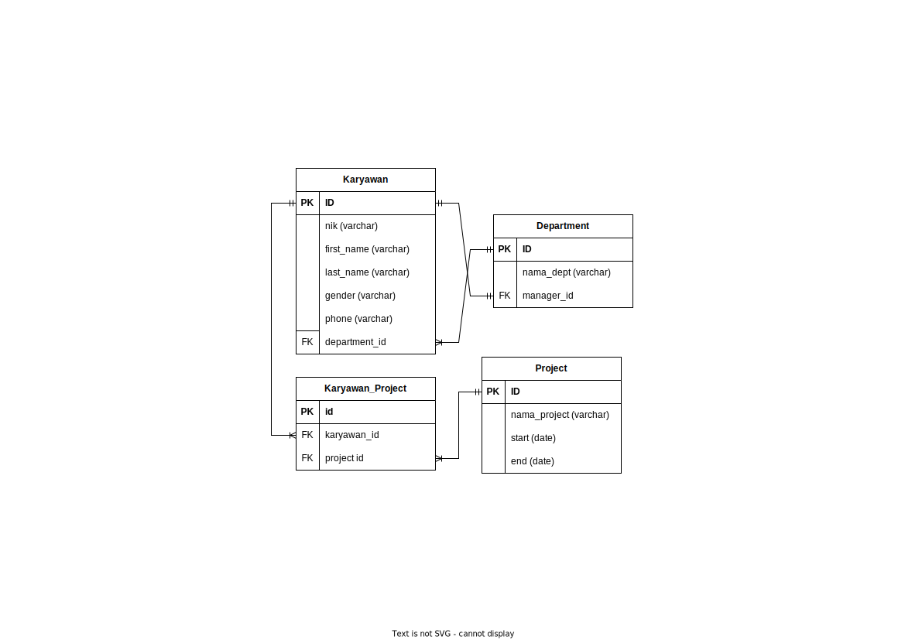
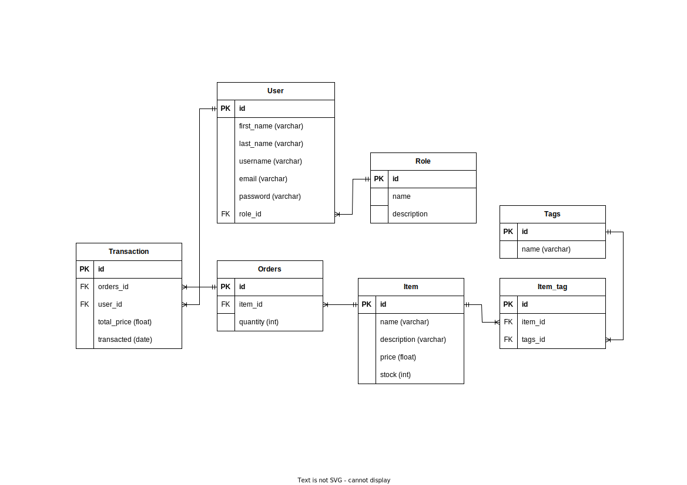
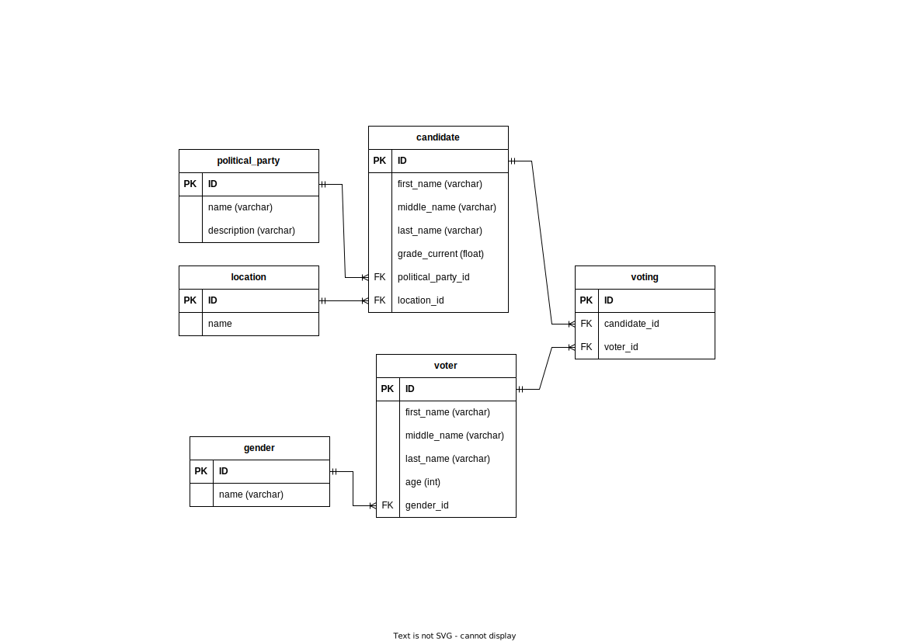
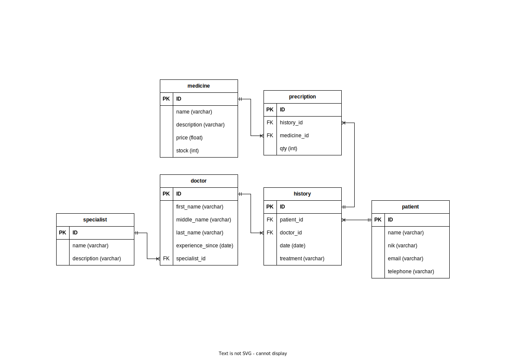
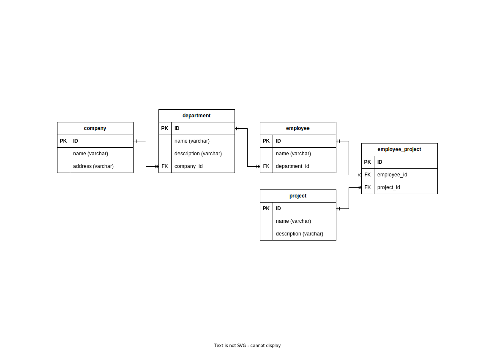

# Entity Relationship Diagram

## Perusahaan

Setiap `karyawan` memiliki NIK, nama depan, nama belakang, jenis kelamin, email, phone number.\
Setiap `karyawan` menempati satu `departemen`.\
Setiap `Departemen` memiliki `manager` dan hanya boleh memiliki satu `manager` saja.\
Di `perusahaan` tersebut memiliki beberapa `projek`, setiap `karyawan` dapat mengerjakan lebih dari satu `projek` dan `projek` tersebut setidaknya dikerjakan minimal oleh satu `karyawan`.



## Address Book

Contact memiliki property/column nama, perusahaan, nomor telepon dan email.

Group memiliki property/column nama.

Setiap Contact dapat memiliki lebih dari 1 Group begitupun sebaliknya.


## Ecommerce

Terdapat 2 jenis user yang bisa log in ke sistem, yaitu admin dan customer.\
Admin dapat input, edit, dan delete item, sedangkan customer tidak boleh ada akses ini.\
Customer dapat melakukan transaksi, dalam 1 transaksi, customer dapat membeli lebih dari 1 item.\
Terdapat tags seperti : kulit, suede, satin, cotton, small, medium, large.\
Setiap item, bisa memiliki lebih dari 1 tag.



## Poll

Sistem dapat menyimpan data mengenai kandidat2 pejabat, terdiri dari nama, partai, lokasi dan grade_current.\
grade_current merupakan angka decimal.\
Sistem juga harus menyimpan data mengenai orang yang akan ikut dalam voting tsb, \
di antaranya :nama depan, nama belakang, jenis kelamin, umur.\
Sistem dapat mencatat siapa saja yang vote pejabat. \
1 orang dapat melakukan vote lebih dari 1 pejabat.\
Kandidat penjabat bisa di vote oleh banyak orang.



## Medical

Sistem dapat menyimpan data mengenai Dokter, terdiri dari nama, spesialisasi, tahun pengalaman\
Sistem dapat menyimpan data User(pasien), terdiri dari nama, NIK, email, dan nomor handphone\
Sistem menyimpan data obat-obatan apa saja yang tersedia di Rumah sakit.\
Sistem dapat mencatat Histori ketika pasien berobat, histori mencakup dokter yang menangani, obat-obatan yang diberikan, tanggal berobat, dan treatment yang diberikan dokter.\
Setiap pasien dapat berkunjung lebih dari satu kali, dan dapat berobat ke banyak Dokter.\
Dokter juga dapat menangani banyak pasien.Setiap pasien berobat, dokter dapat memberikan lebih dari satu jenis obat-obatan.



## Company & Employees Management System

### Entities 

- Company: Each company has a unique ID, a name, and an address.
- Department: Each department has a unique ID, a name, and is associated with a specific company.
- Employee: Each employee has a unique ID, a name, and is associated with one department and one company.
- Project: Each project has a unique ID and a name.

### Relationships

- A Company can have many Employees.
- Each Employee works for one Company.
- Each Employee can work on multiple Projects.
- Each Project can have multiple Employees working on it.
- A Company can have many Departments.
- Each Employee works in one Department.

### 1. Entity Relationship Diagram



### 2. SQL Statements

```sql
CREATE TABLE IF NOT EXISTS company (
    ID INT AUTO_INCREMENT NOT NULL,
    name VARCHAR(100) NOT NULL,
    address VARCHAR(255),
    PRIMARY KEY (ID)
);

CREATE TABLE IF NOT EXISTS department (
    ID INT AUTO_INCREMENT NOT NULL,
    name VARCHAR(100) NOT NULL,
    description VARCHAR(255),
    company_id INT NOT NULL,
    PRIMARY KEY (ID),
    FOREIGN KEY (company_id) REFERENCES company(ID)
);

CREATE TABLE IF NOT EXISTS employee (
    ID INT AUTO_INCREMENT NOT NULL,
    name VARCHAR(100) NOT NULL,
    department_id INT NOT NULL,
    PRIMARY KEY (ID),
    FOREIGN KEY (department_id) REFERENCES department(ID)
);

CREATE TABLE IF NOT EXISTS project (
    ID INT AUTO_INCREMENT NOT NULL,
    name VARCHAR(100) NOT NULL,
    description VARCHAR(255),
    PRIMARY KEY (ID)
);

CREATE TABLE IF NOT EXISTS employee_project (
    ID INT AUTO_INCREMENT NOT NULL,
    employee_id INT NOT NULL,
    project_id INT NOT NULL,
    PRIMARY KEY (ID),
    FOREIGN KEY (employee_id) REFERENCES employee(ID),
    FOREIGN KEY (project_id) REFERENCES project(ID)
);
```