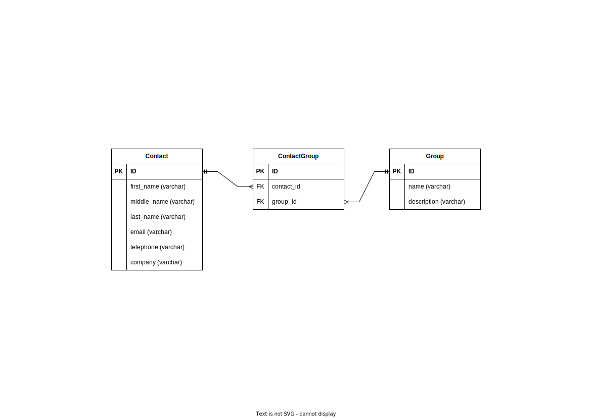

# Entity Relationship Diagram

## Perusahaan

Setiap `karyawan` memiliki NIK, nama depan, nama belakang, jenis kelamin, email, phone numberSetiap `karyawan` menempati satu `departemen`Setiap `Departemen` memiliki `manager` dan hanya boleh memiliki satu `manager` sajaDi `perusahaan` tersebut memiliki beberapa `projek`, setiap `karyawan` dapat mengerjakan lebih dari satu `projek` dan `projek` tersebut setidaknya dikerjakan minimal oleh satu `karyawan`

## Address Book

Contact memiliki property/column nama, perusahaan, nomor telepon dan emailGroup memiliki property/column namaSetiap Contact dapat memiliki lebih dari 1 Group begitupun sebaliknya.

